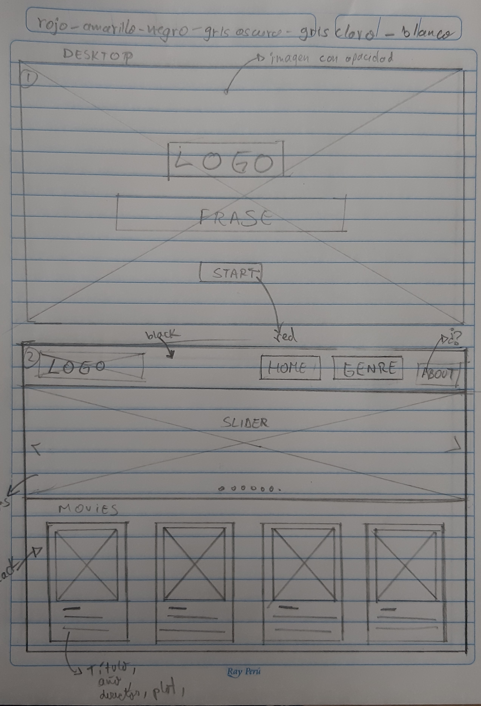
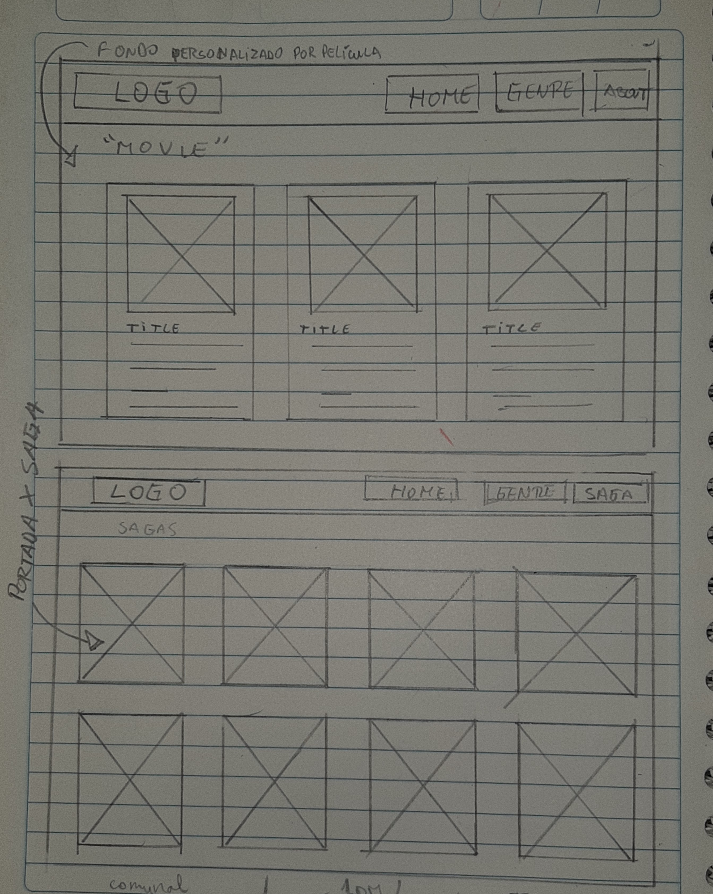

# **MovieThon**

## Contexto y Preámbulo
La vida moderna y el trabajo, muchas veces limita las horas de relajo, lo que hace muy poco posible el adecuado desarrollo de actividades recreacionales, entre ellas, el deleite de ver películas. 
sin embargo, gracias a las nuevas plataformas de video streaming como Netflix, Hulu, Amazon Prime Video, entre otros, las alternativas para disfrutar el arte de ver películas por largas horas consecutivas es cada vez más accesible.
### Problemática
Hemos identificado que muchas personas si bien han deseado ver una maratón de películas en el pasado, muchas no lo han hecho porque no tiene tiempo o ni siquiera tienen tiempo para buscar información para saber por donde empezar.
### Solución
Para ellos creamos ***MOVIETHON***, una plataforma que te permitirá conocer al detalle películas destinadas a verlas en una maratón ordenadas de una manera práctica y accesible.
## Descripción del Producto
### MovieThon es una página web en la que podrás encontrar toda la información necesaria sobre sagas de películas para iniciar esa maratón que tanto estabas postergando.

# Proceso de definición de usuario
Luego de observar la data a trabajar como equipo Front-End y UX, se decidió por orientar la aplicación web a jóvenes adultos que prefieran ver sagas y/o trilogías. 

Para lo cual se realizó una **encuesta** en la cuál preguntamos si les interesaría hacer una maratón de películas si tuvieran la oportunidad a lo cual más del 82% respondió afirmativamente.

Además, preguntamos sobre los géneros que más verían en una maratón de películas.

Esto nos sirvió para poder surtir las películas y seleccionar cuáles usar para nuestra aplicación.

## Usuario definido
Se seleccionó como usuario a **jóvenes de 17 a 35 años interesados en buscar información para hacer una maratón de películas**

# Historias de Usuarios
### 1) “Yo, como usuari@, quiero poder visualizar las portadas y títulos de las películas que el sitio me ofrece"
### 2) "Yo, como usuari@, quiero ver imágenes de las sagas sugeridas a ver"
### 3) "Yo, como usuari@ quiero poder filtrar las películas por su género".
### 4. “Yo como usuari@ quiero ver las películas filtradas/agrupadas por la  saga a la que pertenece”
### 5)  "Yo, como usuari@, al seleccionar la película quiero ver la sinopsis, país, director, año de estreno y rating"

# Iteraciones
### 1era Iteración :
Se recibió feedback sobre:
- La 2da pantalla, sobre la cual mencionaron que como usuari@s les gustaría ver imágenes que le recomienden que sagas ver.

- Se decidió por añadir un slider con 7 portadas de películas y pequeños comentarios que describieran las sagas.
### 2da Iteración:
Se recibió feedback sobre:

-La disposición de los botones del menú estaban
muy juntos y no eran visibles con facilidad

Se cambió:
-La fuente y se separaron entre ellos

# Prototipado
#### Prototipo de baja fidelidad

## Paleta de colores

#### Prototipo de alta fidelidad

